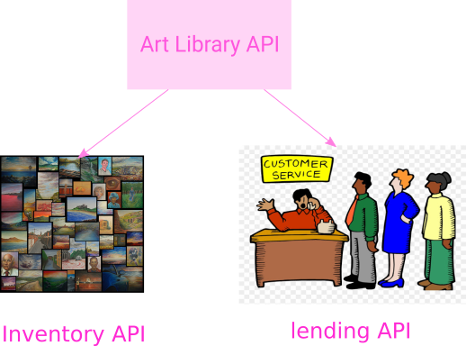

# Art Library API

Purpose of this repo is to demonstrate phases and steps for designing and developing APIs, with suitable toolings/automation in each phase and step.  

API of Art Library. It consists of two main modules: 

1. Artwork CRUD API for admins  
2. API for lending artworks from the library. End users of this API are normal members in the Alpha Org, who want to borrow artworks from the library to decorate their offices. The lending API may need a web frontend for the end users. So the direct consumer of this API are the developers of the lending frontend. 

## Main components of this API

## API Stories

* [API Story :: Art Inventory at Alpha Org](./api-story_art-inventory.md)
* API Story :: Art Lending at Alpha Org

## API Internal Cycles
...
...
