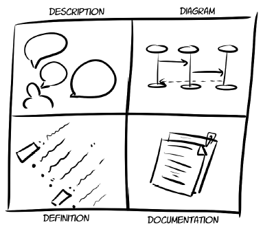
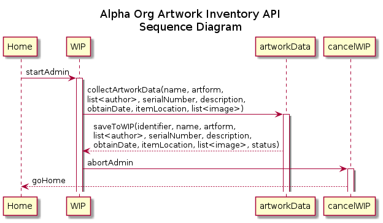
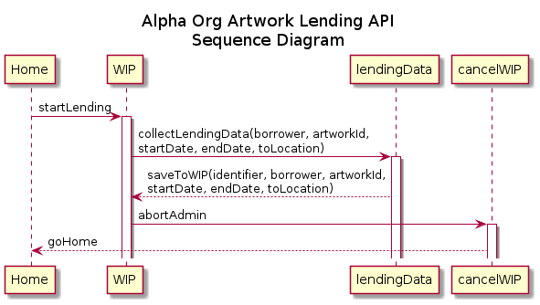
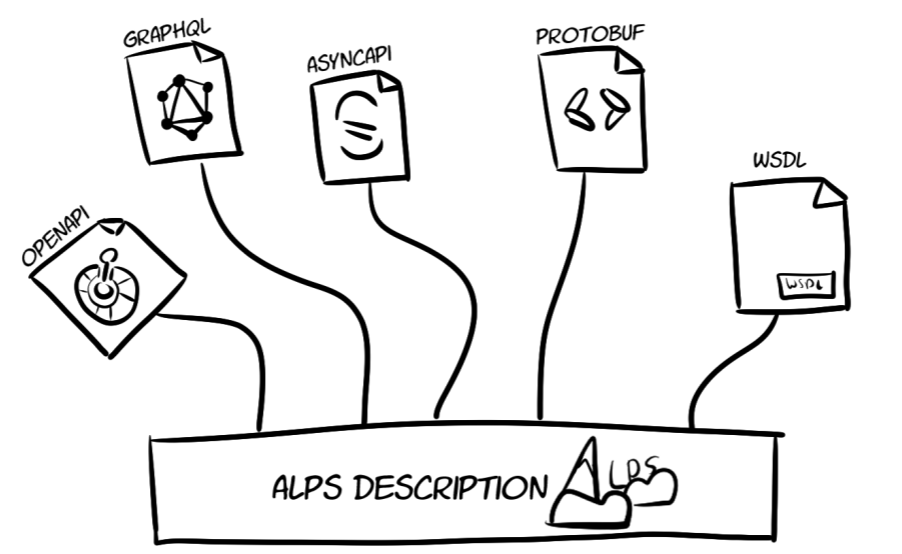

# Notes of the book *Design and Build Great Web APIs* by Michael Amundsen

## Phase 0: Modeling APIs

Discovery of facts around an API involves two key steps.

1. *Map out the API workflow and identify the internal cycles*. This API workflow document helps you get the big picture of what you’re working on. The internal cycles document helps you focus on the details of each small step in the overall workflow.

2. *Write an API story document*. A narrative document that explains just what the API is meant to do, along with the data properties and actions that “animate” that story.

These two steps are iterated again and again, until there's enough information to initialize the first iteration of next major phase: Designing APIs

## Phase 1: Designing APIs

Four kinds of artifacts:

* *Descriptor*: name convention for nouns and verbs
* *Diagram*: visualization of workflow and internal cycles
* *Definition*: a machine-readable API definition document for further implementation
* *Documentation*: basic reference documentation for both service developers and service consumers (those using the API in the future).

These artifacts are also created and updated iteratively.

### Identifying our API Descriptors

* Use [schema.org](https://schema.org/) as a source for validating vocabularies. Example see: [Art-Library-API-Workflow.txt](https://github.com/nnworkspace/art-library-api/blob/main/assets/Art-Library-API-Workflow.txt)
* For banking industry perticularly interesting: [Banking Industry Architecture Network (BIAN)](https://bian.org/)
* Common types of names:
  + data names (e.g. Artwork)
  + action names (e.g. CreateArtwork)
  + state names (e.g. CreatedArtwork)

### Creating Sequence Diagrams

It is very easy to use PlantUML for scripting sequence diagrams. Examples:

1. [inventory-api-sequence.plantuml](./diagrams/inventory-api-sequence.plantuml)

1. [lending-api-sequence.plantuml](./diagrams/lending-api-sequence.plantuml)

### Describing APIs

A description in a formal and standardized language should convert all requirements and features we gathered. It reflects the common understanding in the team. It is not only the foundation of further implemention, but also an essential means of communication between API designers and API builders.

This description should be easily parsed by machine.

And it should not depend on any single technology, document format, or API style. Because we want to allow
further implementation in multiple technologies and API styles. 

We recommend the [*Application-Level Profile Semantics (ALPS)*](http://alps.io/) language for API description, for its simplicity, conciseness, and expressiveness. 

Official GitHub Repo for the alps spec is [here](https://github.com/alps-io/spec). 

---
**NOTE: The property "type" in ALPS descriptor**

The property "type" in ALPS files have two groups of values. All nouns are of the type "semantic", and verbs have three types in the alps file: "safe", "unsafe" and "idempotent". 
Here is the short explanation:

* safe: readly only option, does not change state of the data
* unsafe: write option, changes the state of data
* idempotent: write options, changes the state of data. But the outcome is always the same, no matter how many times the option is performed. An idempotent option is an unsafe option. 
---

Here are the apls files in YAML format for our art library API. 

* [Art Library :: Inventory API]()
* [Art Library :: Lending API]()

